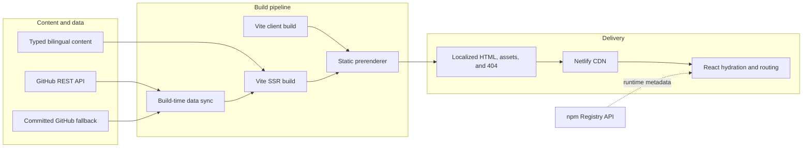

# André Leite Carvalho - Portfolio

[](https://app.netlify.com/projects/andrelcarvalho/deploys)
[](https://react.dev/)
[](https://www.typescriptlang.org/)
[](https://vite.dev/)
[](LICENSE)

An editorial, bilingual portfolio engineered as a production web product not just a collection of project cards. It presents frontend architecture, Design Systems, integrations, open-source work, and software architecture through fast, accessible, indexable case studies.

**Live experience:** [Português](https://andreleitecarvalho.space/pt-BR/) · [English](https://andreleitecarvalho.space/en/)


> The interface tells the professional story; the implementation demonstrates the engineering principles behind it.

## Purpose

This project has two complementary goals:

1. **Communicate clearly** - help recruiters, engineering leaders, and collaborators understand André's experience, areas of expertise, and approach to product development.
2. **Demonstrate by example** - turn architectural decisions, accessibility, performance, localization, content modeling, and deployment reliability into visible parts of the portfolio itself.

Instead of presenting isolated screenshots, each featured project becomes a localized case study with its context, challenge, responsibilities, technical decisions, technologies, and outcome. The result connects visual design with the reasoning required to deliver and evolve real software.

## Design concepts

| Concept                       | How it appears in the experience                                                                                                                          |
| ----------------------------- | --------------------------------------------------------------------------------------------------------------------------------------------------------- |
| **Editorial clarity**         | Display typography, restrained color, generous spacing, and a deliberate reading rhythm give long-form technical content a clear hierarchy.               |
| **System before screens**     | Global CSS custom properties define color, type, spacing, radius, shadow, layout, and motion foundations shared across the experience.                    |
| **Identity with consistency** | Each case study has an `editorial`, `technical`, `playful`, or `directional` visual theme while retaining common layout and interaction rules.            |
| **Progressive disclosure**    | The home page gives a scannable professional overview; dedicated routes reveal the deeper reasoning behind each project.                                  |
| **Inclusive interaction**     | Semantic landmarks, a skip link, visible focus states, descriptive labels, 44 px controls, keyboard-friendly UI, and reduced-motion support are built in. |
| **Bilingual continuity**      | Portuguese and English are first-class routes. Changing language preserves the current project or section, viewport, and selected theme.                  |
| **Mobile-first navigation**   | Fluid spacing and typography scale from 320 px upward, with a safe-area-aware bottom navigation on compact screens.                                       |
| **Quiet motion**              | `IntersectionObserver` adds reveal transitions only when supported and automatically respects `prefers-reduced-motion`.                                   |

The light theme uses a warm paper-like surface and a terracotta accent; the dark theme keeps the same hierarchy with adjusted contrast. Theme tokens live in [`src/styles/index.css`](src/styles/index.css), and project-specific visual identities are modeled in [`src/content/portfolio.ts`](src/content/portfolio.ts).

## Technical architecture

The application combines a statically generated delivery model with client-side React navigation. Visitors receive meaningful localized HTML immediately; React then hydrates the page and enables route transitions, theme persistence, live npm metadata, and interactive behavior.



### Architectural layers

| Layer                    | Responsibility                                                                                                                                                             |
| ------------------------ | -------------------------------------------------------------------------------------------------------------------------------------------------------------------------- |
| **Content model**        | [`src/content/portfolio.ts`](src/content/portfolio.ts) centralizes typed Portuguese and English copy, profile details, timelines, project data, and visual themes.         |
| **Routing and metadata** | [`src/content/routes.ts`](src/content/routes.ts) resolves localized routes and creates canonical URLs, `hreflang`, social metadata, robots rules, and JSON-LD.             |
| **Presentation**         | Page, section, and shared UI components keep content composition separate from navigation and infrastructure concerns.                                                     |
| **Client runtime**       | React Router manages localized navigation, lazy-loaded pages, scroll restoration, section anchors, and project transitions without full document reloads.                  |
| **Static rendering**     | [`src/entry-server.tsx`](src/entry-server.tsx) renders routes on the server; [`scripts/prerender.mjs`](scripts/prerender.mjs) writes the final HTML and custom `404.html`. |
| **External data**        | GitHub highlights are resolved at build time with a cache and fallback. npm package details are requested in the browser with normalized, resilient data handling.         |
| **Delivery**             | Netlify serves the generated `dist` directory with immutable asset caching, security headers, redirect compatibility, and a real not-found experience.                     |

## Core capabilities

- Localized home pages and four case studies in Portuguese and English.
- Typed content instead of copy distributed throughout JSX.
- Per-route SEO with canonical URLs, alternate languages, Open Graph, Twitter Cards, sitemap data, and structured data.
- Route-level code splitting for home, project, and not-found pages.
- Light and dark themes that honor the operating-system preference and persist safely.
- Responsive AVIF, WebP, and JPEG portraits with reserved dimensions, lazy loading, priority hints, and fallbacks.
- Build-time GitHub repository highlights with a four-second timeout, 24-hour cache, curated allowlist, and committed fallback.
- Runtime npm package metadata with loading, partial-success, and failure states.
- Direct contact actions-email, LinkedIn, GitHub, WhatsApp, and copy email-without fragile form or secret-management dependencies.
- Custom static `404.html` and compatibility redirects for previous public URLs.

## Technology stack

| Area                       | Technology                                                           |
| -------------------------- | -------------------------------------------------------------------- |
| UI                         | React 19, TypeScript 5.9, semantic HTML, modern CSS                  |
| Routing                    | React Router 7                                                       |
| Build                      | Vite 8, Node.js 22, custom SSR/prerender scripts                     |
| Content and data           | Typed local content, GitHub REST API, npm Registry API               |
| Images                     | Sharp, AVIF, WebP, progressive JPEG, SVG                             |
| Unit and integration tests | Vitest, Testing Library, `jest-dom`, `axe-core`                      |
| Browser tests              | Playwright with mobile and desktop projects                          |
| Code quality               | ESLint, Prettier, TypeScript project references, Husky, lint-staged  |
| Hosting                    | Netlify static hosting, CDN caching, redirects, and security headers |

## Project structure

```text
ac-portfolio/
├── public/                  # Optimized media, documents, icons, redirects, SEO files
├── scripts/                 # GitHub sync, image optimization, prerender, bundle audit
├── src/
│   ├── components/          # Shared interface and navigation primitives
│   ├── config/              # External package configuration
│   ├── content/             # Typed portfolio copy, routes, generated/fallback data
│   ├── hooks/               # Active-section and remote-data behavior
│   ├── pages/               # Home, project case study, and not-found composition
│   ├── sections/            # Portfolio narrative sections
│   ├── services/            # npm Registry boundary and normalization
│   ├── styles/              # Tokens, themes, responsive layout, component styles
│   ├── App.tsx              # Localized route tree and application shell
│   ├── entry-server.tsx     # Server-rendering entry point
│   └── main.tsx             # Browser hydration entry point
├── tests/                   # Unit, integration, accessibility, routing, and E2E tests
├── netlify.toml             # Build, caching, and security-header configuration
└── vite.config.ts           # Build aliases, development server, and Vitest setup
```

## Build and delivery flow

`npm run build` executes a deliberate sequence:

1. Refresh the curated GitHub data or retain the cached/fallback content.
2. Run the TypeScript project build and type checks.
3. Create the browser bundle with Vite.
4. Create a temporary SSR bundle from `src/entry-server.tsx`.
5. Render 11 public routes plus `404.html`, inject route-specific metadata, and remove the temporary server output.

The resulting `dist` directory is a self-contained static deployment. Netlify adds Content Security Policy, referrer, permissions, framing, and MIME-sniffing protections; fingerprinted assets receive a one-year immutable cache policy.

## Quality strategy

Quality checks focus on behavior and user outcomes rather than implementation details:

- **Accessibility:** automated `axe-core` checks, semantic queries, focus visibility, keyboard interaction, alternative text, and reduced-motion behavior.
- **Responsive behavior:** Playwright projects at 320 px, 390 px, and 1440 px validate navigation, content, and horizontal overflow.
- **Routing:** direct loads, refreshes, lowercase locale compatibility, history navigation, anchors, localized 404s, and language changes are exercised.
- **Reliability:** GitHub data has cache and fallback paths; npm requests support partial failure; image components provide format and error fallbacks.
- **Performance:** page components are lazy-loaded, media is responsive, content is prerendered, and `npm run audit:bundle` enforces a 90 kB gzip budget for generated JavaScript and CSS.
- **Security:** no frontend secrets are required, external data is read-only, and production response headers are declared in source control.

Recorded Lighthouse and validation results are documented in the [portfolio refactor report](docs/portfolio-refactor-report.md).

## Getting started

### Requirements

- Node.js 22
- npm
- Google Chrome for the configured Playwright suite

### Local development

```bash
git clone https://github.com/carvalhoandre/ac-portfolio.git
cd ac-portfolio
npm ci
npm run dev
```

Vite serves the project at `http://localhost:8080` by default. No environment variables are required for the standard development or production build.

### Commands

| Command                   | Purpose                                                           |
| ------------------------- | ----------------------------------------------------------------- |
| `npm run dev`             | Start the Vite development server.                                |
| `npm run build`           | Sync data, type-check, bundle, prerender, and create `dist`.      |
| `npm run preview`         | Preview the production bundle locally.                            |
| `npm run format:check`    | Verify formatting with Prettier.                                  |
| `npm run lint`            | Run ESLint across application, scripts, tests, and configuration. |
| `npm run typecheck`       | Validate all TypeScript project references.                       |
| `npm run test`            | Run the Vitest unit and integration suite.                        |
| `npm run test:e2e`        | Run Playwright across mobile and desktop viewports.               |
| `npm run optimize:images` | Rebuild responsive profile and social image assets.               |
| `npm run sync:github`     | Refresh curated repository data when the cache permits.           |
| `npm run audit:bundle`    | Report asset sizes and enforce the gzip budget.                   |

## Deployment

Production deploys are handled by Netlify:

```text
Build command: npm run build
Publish directory: dist
Node version: 22
```

Route behavior is split intentionally: known routes are served from prerendered files, selected legacy URLs redirect to their current destinations, and missing static assets return the generated `404.html` with HTTP 404. Other unknown URLs fall back to the application shell so React Router can present the localized not-found experience.

## Engineering notes

- [Portfolio refactor report](docs/portfolio-refactor-report.md) - implementation outcome, performance, accessibility, and validation.
- [Experience evolution decisions](docs/experience-evolution-decisions.md) - architecture, data, motion, contact, and product trade-offs.
- [Contact delivery decision](docs/contact-delivery-decision.md) - why direct contact actions replaced an unreliable form workflow.
- [Netlify routing comparison](docs/netlify-routing-comparison.md) - routing and not-found behavior.
- [Search Console setup](docs/search-console.md) - indexing and search verification guidance.

## License

Distributed under the [MIT License](LICENSE). © André Leite Carvalho.
